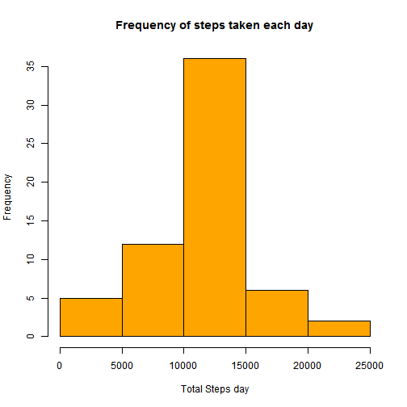

# Reproducible Research - Peer Assessment 1 ##


## Loading and preprocessing the data

This script assumes that file activity.csv is saved on working directory

1.  Load the data (i.e.  read.csv() )
2.  Process/transform the data (if necessary) into a format suitable for your analysis


```r
# libraries
library(data.table)
library(lattice)

# get data
data_all <- fread("activity.csv", header=TRUE, sep = ",")
 
data <- na.omit(data_all)
```


## What is mean total number of steps taken per day?

For this part of the assignment, ignore the missing values in the dataset.

1.  Calculate the total number of steps taken per day


```r
# Calculate the total number of steps taken per day
steps_per_day <- data[, list(stepsday = sum(steps)), by=c("date")]
```

2.  Make a histogram of the total number of steps taken each day


```r
# histogram of the total number of steps taken each day
hist(steps_per_day$stepsday, main="Frequency of steps taken each day", xlab="Total Steps day", col="blue")
```

 


3.  Calculate and report the mean and median of the total number of steps taken per day


```r
# Calculate and report the mean of the total number of steps taken per day
mean(steps_per_day$stepsday)
```

```
## [1] 10766.19
```

```r
# Calculate and report the median of the total number of steps taken per day
median(steps_per_day$stepsday)
```

```
## [1] 10765
```

**The mean and median of total number of steps per day are 10766 and 10765 steps.**


## What is the average daily activity pattern?

1.  Make a time series plot (i.e.  type = "l" ) of the 5-minute interval (x-axis) and the average number of steps taken, averaged across all days (y-axis)


```r
# the average daily activity pattern
average_daily_steps <- data[, list(meanstepsday = mean(steps)), by=c("interval")]

# plot
plot(meanstepsday ~ interval, data = average_daily_steps, type = "l", xlab = "Interval", ylab = "Steps")
```

 


2.  Which 5-minute interval, on average across all the days in the dataset, contains the maximum number of steps?


```r
# 5-minute interval that contains the maximum number of steps
average_daily_steps[which.max(average_daily_steps$meanstepsday)]
```

```
##    interval meanstepsday
## 1:      835     206.1698
```

**The 835th interval has the maximum average number of steps (206.1698).**


## Imputing missing values

Note that there are a number of days/intervals where there are missing values (coded as  NA ). The
presence of missing days may introduce bias into some calculations or summaries of the data.

1.  Calculate and report the total number of missing values in the dataset (i.e. the total number of rows with NA s).


```r
# the total number of missing values in the dataset (i.e. the total number of rows with NAs).
sum(is.na(data_all$steps))
```

```
## [1] 2304
```

**The total number of rows with NA's is 2304 **

2.  Devise a strategy for filling in all of the missing values in the dataset. The strategy does not need to be sophisticated. For example, you could use the mean/median for that day, or the mean for that 5-minute interval, etc.

**For imputation I replaced the NA by the mean of respective 5-minute interval.**


```r
#  I test each step, if is NA then set with the mean else replace with the original value 
data_filled = transform(data_all, steps = ifelse(is.na(steps), mean(steps, na.rm=TRUE), steps))
```


3.  Create a new dataset that is equal to the original dataset but with the missing data filled in.


```r
# total steps per day
steps_per_day_filled <- data_filled[, list(stepsday = sum(steps)), by=c("date")]
```


4.  Make a histogram of the total number of steps taken each day and Calculate and report the mean and
median total number of steps taken per day. Do these values differ from the estimates from the first
part of the assignment? What is the impact of imputing missing data on the estimates of the total daily number of steps?


```r
# total steps per day
steps_per_day_filled <- data_filled[, list(stepsday = sum(steps)), by=c("date")]

# histogram
hist(steps_per_day_filled$stepsday, main="Frequency of steps taken each day", xlab="Total Steps day", col="orange")
```

 


**The mean and median total number of steps taken per day.** 


```r
# Calculate and report the mean of the total number of steps taken per day
mean(steps_per_day_filled$stepsday)
```

```
## [1] 10766.19
```

```r
# Calculate and report the median of the total number of steps taken per day
median(steps_per_day_filled$stepsday)
```

```
## [1] 10766.19
```

**The impact of imputing missing data on the estimates of the total daily number of steps was inexpressive. The mean was equal and for median the difference was only 1.19 step**


## Are there differences in activity patterns between weekdays and weekends?


Changing default.locale to force weekdays() output to English (LC_TIME is saved for later retrieval)

```r
default.locale <- Sys.getlocale("LC_TIME")
Sys.setlocale("LC_TIME", "English") 
```

```
## [1] "English_United States.1252"
```


1.  Create a new factor variable in the dataset with two levels – “weekday” and “weekend” indicating
whether a given date is a weekday or weekend day.


```r
# convert date vriable to date()
data_filled$date <- as.Date(strptime(data_filled$date, format="%Y-%m-%d"))
                                 
# Create a new factor variable in the dataset with two levels – “weekday” and “weekend” 
data_filled$day <- weekdays(data_filled$date)

# change weekdays with factors
data_filled$day[data_filled$day == "Saturday" | data_filled$day == "Sunday" ] <- "weekend"
data_filled$day[data_filled$day == "Monday" | data_filled$day == "Tuesday" | data_filled$day == "Wednesday"| data_filled$day == "Thursday" | data_filled$day == "Friday" ] <- "weekday"

# average daily steps
average_daily_steps_2 <- data_filled[, list(meanstepsday_2 = mean(steps)), by=c("interval","day")]
```


2.  Make a panel plot containing a time series plot (i.e.  type = "l" ) of the 5-minute interval (x-axis) and the average number of steps taken, averaged across all weekday days or weekend days (y-axis). 


```r
# plot
xyplot(meanstepsday_2 ~ interval | factor(day), data = average_daily_steps_2, aspect = 1/2, type = "l", xlab = "Interval", ylab = "Number of steps")
```

 
